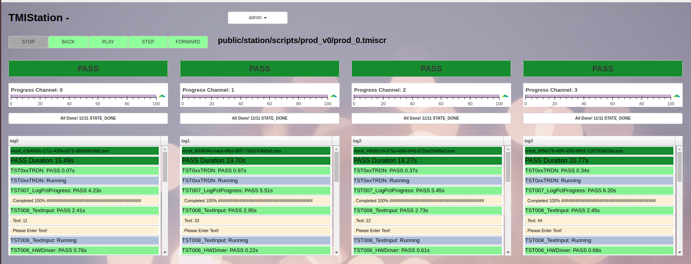

# TMI Station/Server Production Test System

* Now in **BETA**
* A framework to develop automated production test fixtures
* Single PC can control multiple test fixtures
* Write Python scripts to control measurement equipment and other fixtures
* APIs for recording measurements, setting Pass/Fail, locking resources, etc
* Server dashboard to monitor production yield, rate, etc
* Check out the [PDF](https://github.com/mgagcode/tmi_scripts/blob/master/TMISystem_Overview.pdf) slide deck for more information
* postgresql backend
* deployed as Docker containers for easy installation
* https://tmi-scripts.readthedocs.io/en/latest/

# Screenshots

    
# Contact
* email: `tmi.info4u@gmail.com`
