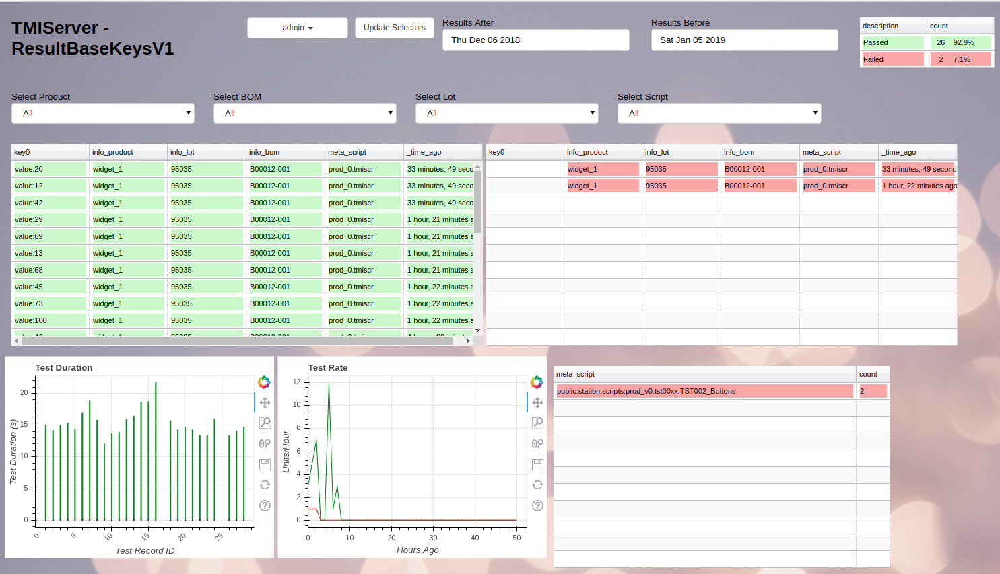

# TMI Station/Server Production Test System

* A framework to develop automated production test fixtures
* Single PC can control multiple test fixtures
* Write Python scripts to control measurement equipment and other fixtures
* APIs for recording measurements, setting Pass/Fail, locking resources, etc
* Server dashboard to monitor production yield, rate, etc
* Check out the PDF slide deck for more information
* postgresql backend
* deployed as Docker containers for easy deployment

# Screenshots




# Installation
* There are 3 components to the system
  * TMIStation
    * This is the interface that production operators would use
    * There can be many TMIStations on a LAN
  * TMIServer
    * There should only be one of these per LAN
    * Should have a fixed IP address
  * postgresql backend
    * There should only be one of these per LAN
    * Should have a fixed IP address
* Its possible that ONE PC can host all three components, and thats how these DEMO instructions are applied.
  * more distributed architectures are recommended for real production
  * ONE station is easier to DEMO because localhost is used for IP addresses
* Operating System
  * The system was developed on both Windows 10 and Ubuntu 18.04
  * Most testing occurs on Ubuntu given its the expected OS used in the factory because of cost (its free)
  * All these instructions are for Ubuntu
* Outside Software Requirements (its all free)
  * Google Chrome browser (other browsers are not tested)
  * install Docker (https://docs.docker.com/install/linux/docker-ce/ubuntu/)
  * Python IDE (many to choose from) (NOT needed for the DEMO)
    * https://www.jetbrains.com/pycharm/download/#section=linux
  * git (NOT needed for pure DEMO mode)
  
    `sudo apt-get install git`
* TMIStation (pure DEMO mode)
  * Pull the tmistation image from Docker
  
    `docker pull mgagcode/tmistation`
  * Demo mode execution (prepacked scripts)
  
    `docker run -ti -p 6800:6800 mgagcode/tmistation`

  * Open Google Chrome to
  
        http://127.0.0.1:6800 

  * TMIStation login user/password is admin/admin
  * Run your first script
    * Select pulldown menu item 'Test Config'
    * Select script 'prod_0.tmiscr'
    * Press button 'Submit'
    * If everything checked out, you should be on the test screen, press Play to test
* TMIServer (pure DEMO mode)
  * In Pure DEMO mode, none of your results will be saved, as they are stored in the Docker container.  There are instructions below to run in none Demo mode.
  * TMIServer needs the postgresql backend to be running in order to work
    * make a new directory in your home directory, change into it, create a data directory, and run Docker postgres command (this will pull postgres container)
    
        ```
        mkdir ~/postgres
        cd ~/postgres
        mkdir datadir
        docker run --name tmi-postgres -p 5432:5432 -v $(pwd)/datadir:/var/lib/postgresql/data -e POSTGRES_PASSWORD=qwerty -d postgres:11
    
    * now create the required databases - you only need to do this *ONCE*
    ```
    docker exec -it tmi-postgres bash
    psql -U postgres
    CREATE DATABASE ResultBaseV1;
    CREATE DATABASE ResultBaseKeysV1;
    \q
    exit
    
  * Pull the tmiserver image from Docker
  
    `docker pull mgagcode/tmiserver`

  * Run "tmiserver" container
    
        `docker run -ti -p 6800:6800 mgagcode/tmiserver`

  * TMIServer login user/password is admin/admin

* NON-DEMO mode
  * When the TMI image is run, the container will now have a host directory mapped to its internal directory, in this way, all the data you create will be stored on your computer.
  * There is a prescriptive directory structure to use, and that is stored on github, so we will be cloning that repo
    * This github repo is how you would version control your own scripts.  Instead of clonning the repo, you would fork it, making it your own, and then add your own code.
    * in this way, when TMI gets updated with new drivers and such, you can easily pull those as well
  * TMIStation
  
    ```
    mkdir ~/git
    mkdir ~/git/tmistation
    cd ~/git/tmistation
    git clone https://github.com/mgagcode/tmi_scripts.git
    cd ~/git/tmistation/tmi_scripts/public
    docker run -ti -p 6800:6800 -v $(pwd):/app/public tmistation

  * TMIServer
  
    ```
    mkdir ~/git
    mkdir ~/git/tmiserver
    cd ~/git/tmiserver
    git clone https://github.com/mgagcode/tmi_scripts.git
    cd ~/git/tmiserver/tmi_scripts/public
    docker run -ti -p 6800:6800 -v $(pwd):/app/public mgagcode/tmiserver


# TMI Scripts
* Examples of scripts/code
    * Testing is controlled by JSON 'script files'
      * Human readable, allows for non-programmers to change limits, enable/disable tests
    * Script files reference python code that runs the script
* Check out the public directory
    * other directories provide a framework for running code outside the framework, for development purposes

# Development Installation
* A simple console environment is available for developing scripts outside of the web GUI interface
* Development on Ubuntu 18.04, or Windows 10
* Python 3.6+ is required
* Clode this repo to get started (its the same setup as the TMIStation, except we won't be running the TMIStation Docker image)

    ```
    mkdir ~/git
    mkdir ~/git/tmistation
    cd ~/git/tmistation
    git clone https://github.com/mgagcode/tmi_scripts.git
    cd ~/git/tmistation/tmi_scripts/public

* Run this command to test if everything is working,

    `python3 tmidev.py --script public/station/scripts/prod_v0/prod_0.tmiscr`
    
# Advanced Notes
* Record Types
    * A record type defines the result JSON file and the backend server database
    * ResultBaseKeysV1
        * An example of how to extend the base record type
        * This extension is used for the Demo scripts
        * It extends the base class be adding 4 "keys" to the JSON result which end up as entries in the backend DB
        * Extending the base record type requires backend programming, don't extend the record type unless you have contacted TMI for backend support
