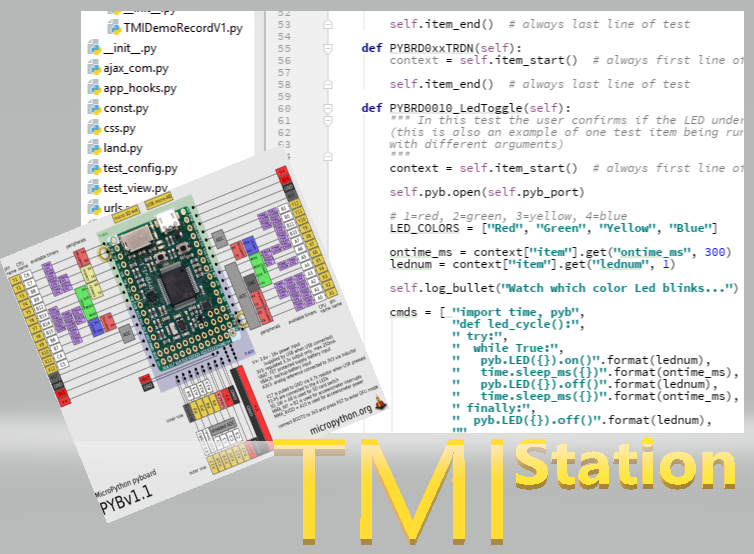

Welcome to TMI's documentation!
===============================

The TMI platform is a manufacturing test system that provides a framework for creating
test programs to test your product, and a backend dashboard to monitor production.  The
platform is intended to allow you to focus on testing your product, rather than the
infrastructure to manage the data, scripts, users, roles, reporting and other mundane stuff.

.. toctree::
   :maxdepth: 2
   :caption: Contents:

   tmistation_main
   tmiserver_main
   tmi_system
   tmi_prodplan
   tmi_development
   tmi_jigs
   tmi_security

Indices and tables
==================

* :ref:`genindex`
* :ref:`modindex`
* :ref:`search`
