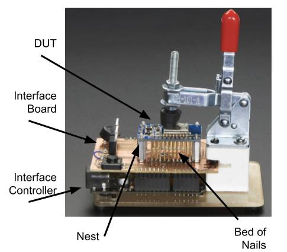

Test Jigs
#########

Test Jigs are used in production to test your product, which is referred to as Device Under Test (DUT).
These are custom designed fixtures that interface your product (DUT) to the TMIStation programs.

In general, it is your responsibility to develop your own test jigs based on your requirements.
TMI (in general) does not build jigs.  That being said, TMI has a reference platform that you may
be able to use, perhaps with some modifications.

.. contents::
   :local:

Definitions
===========

Interface Board
---------------

* A Printed Circuit Board (PCB) that has spring probes and some type of controller that
  the TMIStation can talk to, to take measurements, and otherwise control the stimulus to the DUT.
* Are custom developed depending on the DUT requirements

  * TMI has developed a reference design based on MicroPython board, see TBD

Interface Controller
--------------------

* A device with USB connectivity and a processor in which TMIStation can control and
  otherwise interface to
* Examples that could be used, Arduino, MicroPython, RaspBerry Pi, etc
* An ``Interface Controller`` may be designed into the ``Interface Board`` or
  it can be a daughter card that plugs into an ``Interface Board``

  * TMI has developed a reference design based on MicroPython board, see TBD

Bed of Nails
------------

* An arrangement of spring mounted probes that make electrical connection to the DUT
* the DUT has test points, which are large pads that the spring probes will make contact with

Nest
----

* A landing site for the DUT
* designed to make alignment between the Bed of Nails and the DUT test points

Considerations
==============

* Bed of Nails (probes) can wear out over time, you may want to consider a design that
  allows the Bed Of Nails to be replaced.  This ultimately depends on the cost of replacement.

