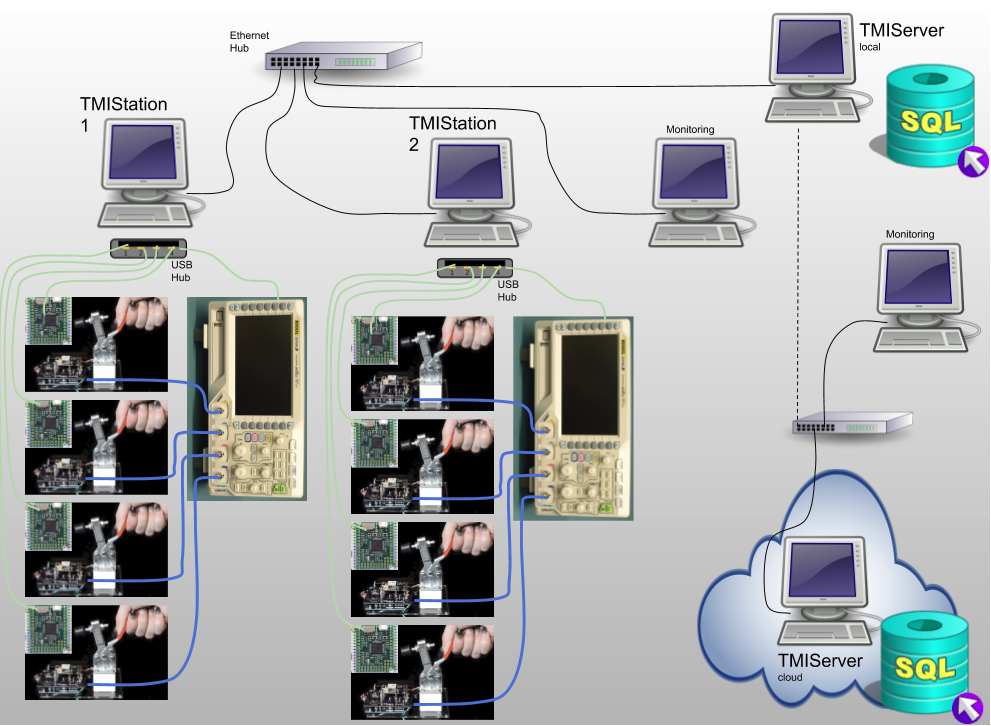

System
######

This section describes system related considerations to building your test system with
TMIStation and TMIServer.

.. contents::
   :local:

Architecture
************

Notes:

* Local wired LAN for TMIStations and TMIServer (local)

  * Wired LANs are more reliable and secure than wireless
  * This LAN should NOT have a connection to the internet

* TMIStations

  * only two are shown but there can be as many as needed
  * USB is used to connect to local test jigs and test equipment
  * Test equipment can be shared across test jigs at one TMIStation

    * Support for sharing equipment across TMIStations is not (yet) supported

  * Sends results to a TMIServer

    * if a TMIServer is not online, testing can still continue, results will
      be staged for upload to the TMIServer when it comes online

* TMIServer

  * there should only be ONE per LAN
  * this computer should have a fixed IP address as every TMIStation is configured
    to look for the TMIServer
  * TMIServer can be configured to send its results upstream to another TMIServer
  * TMIServer can be run in the cloud

    * Local TMIServers can be configured to send their results upstream to a cloud
      based TMIServer, thus all you results can end up in one place
    * As noted above, you donj't want to have your production LAN connected to the
      internet for security and reliablity reasons, therefore, at some regular
      interval you will remove a local TMIServer from the production LAN and connect it
      to the internet so it can find the upstream TMIServer and upload results to it

Definitions
===========

``Test Jigs``

* These are custom designed fixtures that interface your product (Device Under Test (DUT))
  to the TMIStation programs

* ``Test Jigs``

  * have ``Interface Boards`` (see defintion)
  * have a nest where your DUT PCB is located and aligned to the spring probes

``Interface Board``

* A Printed Circuit Board (PCB) that has spring probes and some type of controller that
  the TMIStation can talk to, to take measurements, and otherwise control the stimulus to the DUT.
* Are custom developed depending on the DUT requirements

  * TMI has developed a reference design based on MicroPython board, see TBD

``Interface Controller``

* A device with USB connectivity and a processor in which TMIStation can control and
  otherwise interface to
* Examples that could be used, Arduino, MicroPython, RaspBerry Pi, etc
* An ``Interface Controller`` may be designed into the ``Interface Board`` or
  it can be a daughter card that plugs into an ``Interface Board``

  * TMI has developed a reference design based on MicroPython board, see TBD

